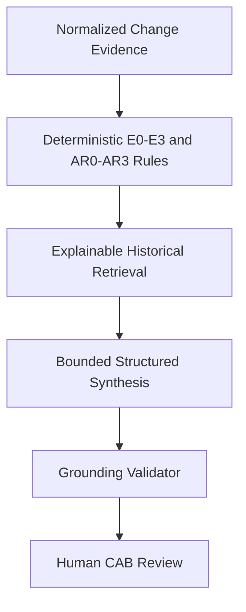

# Architecture and data flow

## Control sequence

| Stage | Input | Output | Control boundary |
| --- | --- | --- | --- |
| Normalize | Synthetic change package | `ChangeEvidence` | Fixed schema; no free-form interpretation required |
| Deterministic checks | `ChangeEvidence` | Evidence observations and aggregate state | Rule-owned E0–E3 and AR0–AR3 results |
| Retrieval | Structured retrieval query | Historical records plus match reasons | Threshold, top-k, and near-duplicate suppression |
| Synthesis | Current evidence, rules, history, fixed instructions | Structured observations, questions, recommendations | No unrelated raw data; no final decisions |
| Grounding | Structured synthesis plus evidence set | Accepted or failed-closed result | Every material claim needs valid evidence IDs |
| Review | Grounded analysis | Reviewer edits, comments, lifecycle state | Human can accept supporting material, not approve the change |

## Evidence trace

Evidence IDs identify one of three source classes:

- `CURRENT:changeEvidence` — normalized current package.
- `RULE:<code>` — deterministic finding and its evidence paths.
- `HIST:<id>` — retrieved historical record.

Every material risk observation has an evidence trace. The reviewer UI shows the source IDs and reasoning provenance.
